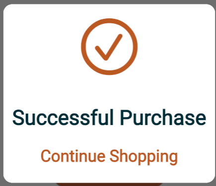
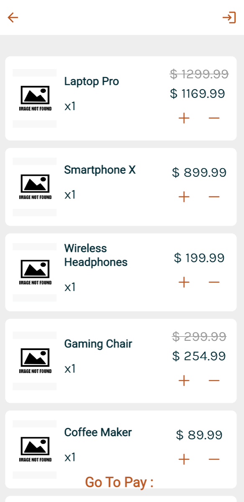
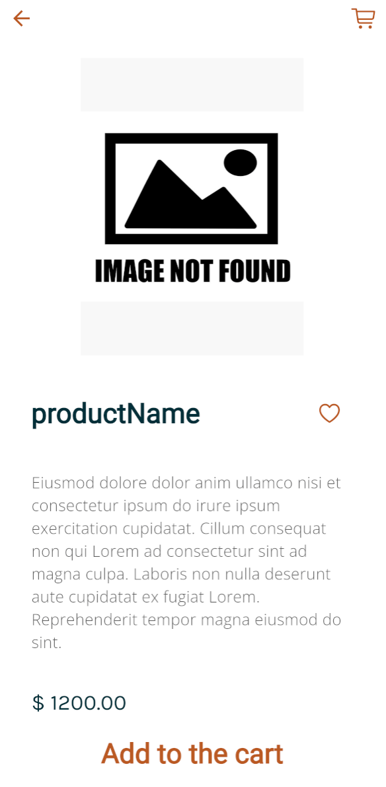

# Atomic Design For E-Commerce Apliacations

A modern e-commerce application built with Flutter that showcases a seamless shopping experience with various templates such as product detail pages, user profiles, login screens, and a shopping cart.

## Table of Contents

- [Features](#features)
- [Installation](#installation)
- [Usage](#usage)
- [App Structure](#app-structure)
  - [Widgets](#widgets)
    - [Product Info Container](#product-info-container)
    - [Product Cart Container](#product-cart-container)
    - [Product Home Container](#product-home-container)
    - [Skeleton info Container](#skeleton-info-container)
    - [Company Info](#company_info)
    - [Custom Dialog](#custom-dialog)
    - [Custom Appbars](#custom-appbars)
    - [List Category](#list-category)
    - [Is Favorite](#is-favorite)
    - [Cart Template](#cart-template)
    - [Home Template](#home-template)
    - [Login Template](#login-template)
    - [Product Template](#product-template)
    - [User Template](#user-template)
    - [Custom Floating Notifications](#custom-floating-notifications)
- [License](#license)

## Features

- Display products in a grid layout.
- Users can view product details and add them to their cart.
- Customizable app bar with options like log in, log out, and cart view.
- User profile management including editing and viewing personal details.
- Authentication flow for login and registration.
- Error handling and loading states.

## Installation

Follow these steps to install and set up the application on your local machine:

1. Clone the repository:
    ```bash
   git clone https://github.com/Maullin1996/fake_store_api_design.git
2. Navigate into the project directory:
    ```bash
    cd fake_store_api_design
3. Provide the texts in json format follow the format in assets/locale/en/semantics_json.json and 'assets/design/copys.json'
    ```bash
    main() async{
      WidgetsFlutterBinding.ensureInitialized();
      await AtomicDesignConfig.initializeFromAsset('assets/design/copys.json');
      await SemanticsConfig.initializeFromAsset(
        'assets/locale/en/semantics_json.json',
      );
    }
4. Install the dependencies:
    ```bash
    flutter pub get
5. Run the application:
    ```bash
    flutter run
## Usage

Once the app is installed, you can use it on your Android or iOS emulator or on a physical device. The app offers a smooth user interface where users can browse products, view product details, and manage their cart.

- Login Flow: Users can log in using their credentials and access personalized features like their cart and favorites.

- Product Pages: Users can see product details including description, price, and add items to their cart.

- User Profile: Users can view and update their profile information.

## App Structure

This Flutter project is structured around several templates and components that make up the UI of the app. The main components include:

- ## Widgets

- ### Product Info Container
- Displays detailed information about a specific product, including its image, description, price, and a button to add it to the cart.
    ```bash
    class ProductInfoContainer extends StatelessWidget {
      /// The URL of the product image.
      final String url;
      /// Must be a valid assets image URL.
      final String assetsImage;
      /// The name of the product.
      final String productName;
      /// A detailed description of the product.
      final String description;
      /// The price of the product.
      final double productPrice;
      /// Whether the product is in promotion.
      final bool isPromotion;
      /// Discount value
      final double discount;
      /// The callback function for the "Add to cart" button.
      final Function()? onPressedbuy;
      /// Whether the product is marked as a favorite.
      final bool isFavorite;
      /// The callback function for the favorite button.
      final Function()? onPressedFavorite;
    }
<p align = "center">
  
</p>

- ### Product Cart Container
- Displays detailed information about the product that you want to buy, including its image, price, quantity, and a two buttons to increase or decrease the quantity of the productyou want to buy.
    ```bash
      class ProductCartContainer extends StatelessWidget {
      /// Image URL for the product.
      final String url;
      /// Local fallback image path if [url] fails to load.
      final String assetsImage;
      /// Name of the product.
      final String productName;
      /// Quantity or unit description of the product (e.g., "2 x 500ml").
      final String amount;
      /// Regular price of the product.
      final double productPrice;
      /// Detailed product description.
      final String description;
      /// Whether the product is under a promotional discount.
      final bool isPromotion;
      /// Discount percentage to apply if [isPromotion] is true (e.g., 0.2 for 20%).
      final double discount;
      /// Callback when the plus button is pressed.
      final Function()? onPressedplus;
      /// Callback when the minus button is pressed.
      final Function()? onPressedminus;
      /// Callback when the container is tapped for more info.
      final Function()? onPressedinfo;
        // constructor and build method...
      }
<p align = "center">
  
</p>

- ### Product Home Container
- Displays a product's image, name, category, price, and buttons for
buying the product, viewing more information, and adding it to favorites.
    ```bash
      class ProducthomeContainer extends StatelessWidget {
        /// URL of the product image.
        final String url;
        /// Local asset fallback image.
        final String assetsImage;
        /// Product name displayed prominently.
        final String productName;
        /// Category of the product (e.g., "Beverages").
        final String productCategory;
        /// Regular price of the product.
        final double productPrice;
        /// Callback when the "Add to Cart" button is pressed.
        final Function()? onPressedbuy;
        /// Callback when the product container is tapped for more info.
        final Function()? onPressedinfo;
        /// Callback when the favorite icon is pressed.
        final Function()? onPressedFavorite;
        /// Whether the product is currently marked as favorite.
        final bool isFavorite;
        /// Whether the product has a promotional price.
        final bool isPromotion;
        /// Discount percentage applied if [isPromotion] is true.
        final double discount;
        // constructor and build method...
      }

<p align = "center">
  
</p>

- ### Skeleton info Container
- Displays a shimmering layout that mimics the structure of a product card, including image, title, category, price, and button
    ```bash
      class SkeletonLoadingContainer extends StatelessWidget {
        /// The total width available for layout and internal scaling.
        final double width;
        // constructor and build method...
      }

<p align = "center">
  
</p>

- ### Company Info
- A widget that displays company contact information such as address, email, WhatsApp, and Instagram.
    ```bash
    class CompanyInfo extends StatelessWidget {
    }

<p align = "center">
  
</p>

- ### Custom Dialog
- Displays a dialog with different content and actions depending on whether the user is authenticated or unauthenticated.
    ```bash
    enum DialogType {authenticated,unauthenticated}
    class CustomDialog extends StatelessWidget {
      // Type of dialog authenticated or unauthenticated.
      final DialogType dialogType;
      // Callback for when the dialog button is pressed.
      final VoidCallback? onDialogButtonPressed; 
      // Total amount to be paid.
      final String totalToPay;
      // constructor and build method...
    }
<p align = "center">
  
</p>
<p align = "center">
  
</p>

- ### Custom Appbars
- Display a appbar that the user can customized with headers and customizable functions
    ```bash
    class CustomAppbars extends StatelessWidget implements PreferredSizeWidget {
        // The type of the AppBar (product, cart, etc.)
        final AppbarType appbarType; 
        // The user first name (optional)
        final String? name; 
        // The user last name (optional)
        final String? lastName; 
        // Action to perform when the back button is pressed
        final Function()? backonPressed; 
        // Action to perform when the cart button is pressed
        final Function()? cartonPressed;
        // Action to perform when the login button is pressed 
        final Function()? logInonPressed; 
        // Action to perform when the logout button is pressed
        final Function()? logOutonPressed;
        // Action to perform when the user profile button is pressed 
        final Function()? useronPressed; 
      // constructor and build method...
  }
  
<p align = "center">
  
</p>
<p align = "center">
  
</p>

- ### List Category
- Displays a list of predefined categories as horizontally scrollable buttons.
The selected category button is styled differently to indicate the current selection.
    ```bash
    class ListCategory extends StatelessWidget {
      // The category currently selected by the user.
      final String selectedCategory; 
      // Callback triggered when a category is selected.
      final ValueChanged<String> onCategorySelected; 
    // constructor and build method...
  }
<p align = "center">
  
</p>

- ### Custom Floating Notifications
- provides a method to display a floating toast message with different content, background, and text colors based on the product verification status (added, not added, or error).
    ```bash
    enum TypeVerification {
      // The product was added successfully.
      added,
      // The product was already added.
      notAdded, 
      // A custom error message.
      errorMessage, 
    }
    class CustomFloatingNotifications {
      // Optional error message to be used when TypeVerification.errorMessage is triggered.
      final String? errorMessage;
    // constructor and build method...
      // A method to trigger the toast notification based on the verification status.
      //
      // The toast message, background color, and text color are determined by the type of verification.
      void customNotification(TypeVerification type) {
        _showToast(type);
    }
  }

<p align = "center">
  
</p>
<p align = "center">
  
</p>

- ### Is Favorite
- shows a product name in a `Text` widget and an icon button that allows the user to mark the product as a favorite.
    ```bash
    class IsFavorite extends StatelessWidget {
      // The name of the product.
      final String productName;
      // The style applied to the product name text. 
      final TextStyle textStyle;
      // Whether the product is a favorite or not.
      final bool isFavorite;
      // The callback function triggered when the favorite button is pressed.
      final Function()? onPressedFavorite; 
  // constructor and build method...
  }
<p align = "center">
  
</p>

- ### Cart Template
- Shows the user's shopping cart with a list of added products. It provides options to remove or add quantities to items in the cart, and displays the total amount to be paid.
    ```bash
    class CartTemplate extends StatelessWidget {
      /// Indicates if the user is authenticated.
      final bool authentication;
      /// Path to the local fallback image asset.
      final String assetsImage;
      /// Users first name (optional, used when authenticated).
      final String? name;
      /// Users last name (optional, used when authenticated).
      final String? lastName;
      /// Total amount to pay displayed in the bottom dialog.
      final String totalToPay;
      /// List of cart items to render.
      final List<dynamic> listCart;
      /// Callback triggered when the back button is pressed.
      final VoidCallback? backonPressed;
      /// Callback triggered when logout is requested.
      final VoidCallback? logOutonPressed;
      /// Callback triggered when login is requested.
      final VoidCallback? logInonPressed;
      /// Callback triggered when the minus button is tapped on a cart item.
      final void Function(dynamic)? onPressedminus;
      /// Callback triggered when the plus button is tapped on a cart item.
      final void Function(dynamic)? onPressedplus;
      /// Callback triggered when the dialog button (checkout/login) is pressed.
      final VoidCallback? onDialogButtonPressed;
      /// Callback triggered when a cart item is tapped for more information.
      final void Function(dynamic)? onPressedinfo;
          // constructor and build method...
    }
<p align = "center">
  
</p>

- ### Home Template
- The home screen of the app, where users can browse through different product categories, view a list of products, and add products to their favorites or cart.
    ```bash
    class HomeTemplate extends StatelessWidget {
      /// The companys physical address shown at the bottom.
      final String address;
      /// Local fallback image asset path for products.
      final String assetsImage;
      /// The companys support email address.
      final String email;
      /// The companys WhatsApp contact.
      final String whatsapp;
      /// The companys Instagram handle.
      final String instagram;
      /// List of product categories to filter the product list.
      final List<String> categories;
      /// Indicates whether the user is logged in.
      final bool isLogIn;
      /// Complete list of available products.
      final List<dynamic> products;
      /// Message to display in case of an error fetching products.
      final String errorMessage;
      /// Indicates if the product list is currently loading.
      final bool isLoading;
      /// List of users favorite products.
      final List<dynamic> myFavoriteList;
      /// List of products added to the users cart.
      final List<dynamic> myCartList;
      /// Currently selected category filter.
      final String selectedCategory;
      /// Callback when the favorite icon is pressed.
      final void Function(dynamic)? onPressedFavorite;
      /// Callback when product info is tapped.
      final void Function(dynamic)? onPressedinfo;
      /// Callback when buy button is pressed.
      final void Function(dynamic)? onPressedbuy;
      /// Callback when login is requested.
      final VoidCallback? logInonPressed;
      /// Callback when the cart icon is tapped.
      final VoidCallback? cartonPressed;
      /// Callback when the user icon is tapped.
      final VoidCallback? useronPressed;
      /// Callback when logout is requested.
      final VoidCallback? logOutonPressed;
      /// First name of the logged-in user.
      final String? name;
      /// Last name of the logged-in user.
      final String? lastName;
      /// Callback to select a new product category.
      final void Function(String) onCategorySelected;
      /// Callback when a product is selected from search results.
      final void Function(String selectedItem) onItemSelected;
      /// Callback to refresh the product list.
      final Future<void> Function() refreshProducts;
      // constructor and build method...
    }

<p align = "center">
  
</p>

- ### Login Template
- Handles the user login flow, including text fields for username and password and a button to submit the credentials.
    ```bash
    class LoginTemplate extends StatelessWidget {
      /// A flag indicating whether the login button is in a loading state.
      final bool? isLoadingButton;
      /// The callback function for when the cart button is pressed.
      final VoidCallback? cartonPressed;
      /// The callback function for when the back button is pressed.
      final VoidCallback? backonPressed;
      /// The callback function for when the login button is pressed.
      final VoidCallback? onPressed;
      /// The callback function to handle changes to the password field.
      final Function(String)? onChangePassword;
      /// The callback function to handle changes to the username field.
      final Function(String)? onChangeUsername;
      /// A controller for the username input field.
      final TextEditingController? usernameController;
      /// A controller for the password input field.
      final TextEditingController? passwordController;
      /// A validator function for the password field.
      final String? Function(String?)? validatorPassword;
      /// A validator function for the username field.
      final String? Function(String?)? validatorUsername;
      /// Whether to obscure the text in the input.
      final bool obscureText;
      /// The path of the logo image.
      final String path;
      /// Change obcureText state.
      final Function()? iconOnPressed;
      // constructor and build method...
    }

<p align = "center">
  
</p>

- ### Product Template
- Displays a product's detailed information in a separate screen, including its image, price, and description. The user can add the product to the cart or mark it as a favorite.
    ```bash
    class ProductTemplate extends StatelessWidget {
      // A flag indicating whether the product is marked as a favorite.
      final bool isFavorite;
      // The callback function for when the cart button is pressed.
      final VoidCallback? cartonPressed;
      // The callback function for when the back button is pressed.
      final VoidCallback? backonPressed;
      // The callback function for when the favorite button is pressed.
      final VoidCallback? onPressedFavorite;
      // The callback function for when the buy button is pressed.
      final VoidCallback? onPressedbuy;
      // The URL of the product image.
      final String url;
      // A description of the product.
      final String description;
      // The name of the product.
      final String productName;
      // The price of the product.
      final String productPrice;
      // constructor and build method...
    }

<p align = "center">
  
</p>

- ### User Template
- Shows the user's profile information, such as their name, email, phone, and address. Users can log out, view their cart, or navigate back to the previous screen.
    ```bash
    class UserTemplate extends StatelessWidget {
        /// The callback function for when the back button is pressed.
        final VoidCallback? backonPressed;
        /// The callback function for when the cart button is pressed.
        final VoidCallback? cartonPressed;
        /// The callback function for when the log out button is pressed.
        final VoidCallback? logOutonPressed;
        /// The user's last name.
        final String lastName;
        /// The user's first name.
        final String name;
        /// The user's username.
        final String username;
        /// The user's email address.
        final String email;
        /// The user's phone number.
        final String phone;
        /// The user's city of residence.
        final String city;
        /// The user's street address.
        final String street;
        /// The user's street number.
        final String number;
        /// The user's postal code.
        final String zipcode;
        // constructor and build method...
      }

<p align = "center">
  
</p>

## License
This project is licensed under the MIT License - see the LICENSE file for details.


